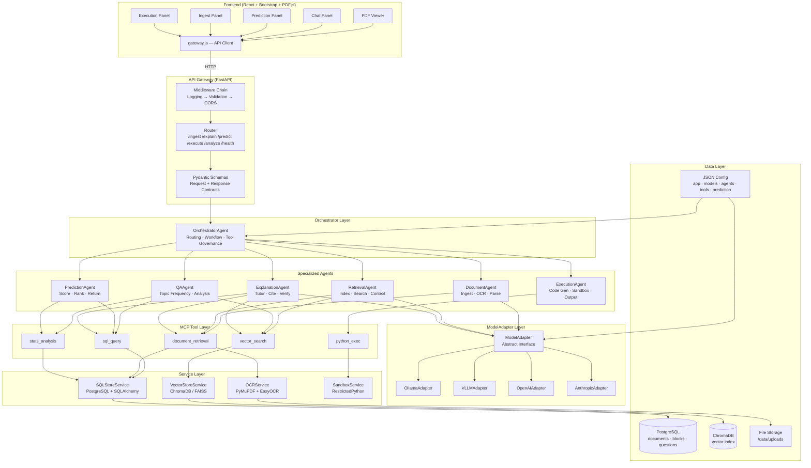
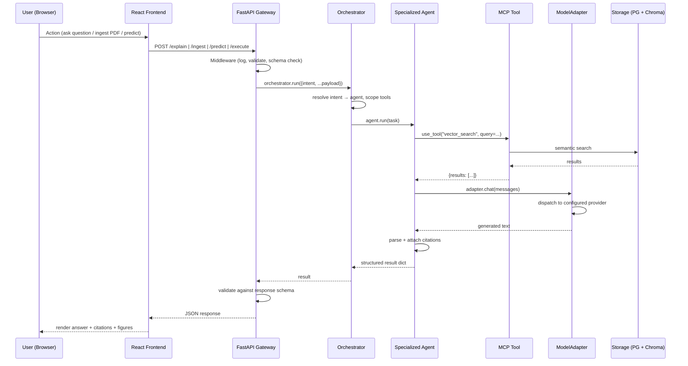
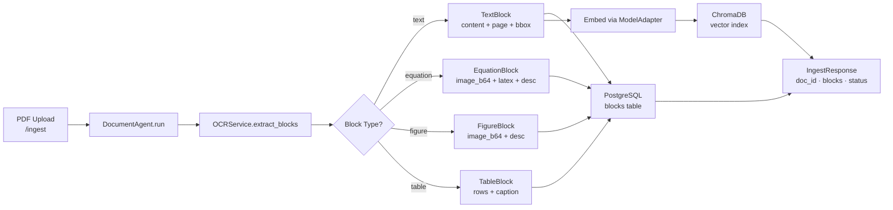
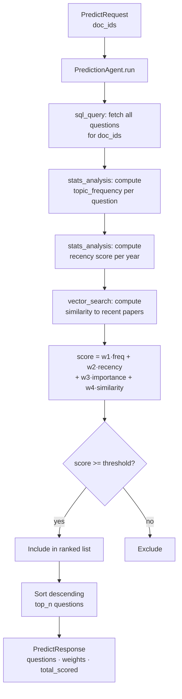
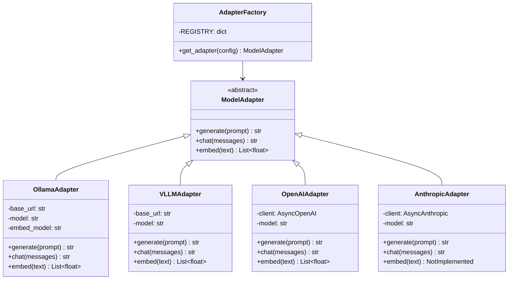
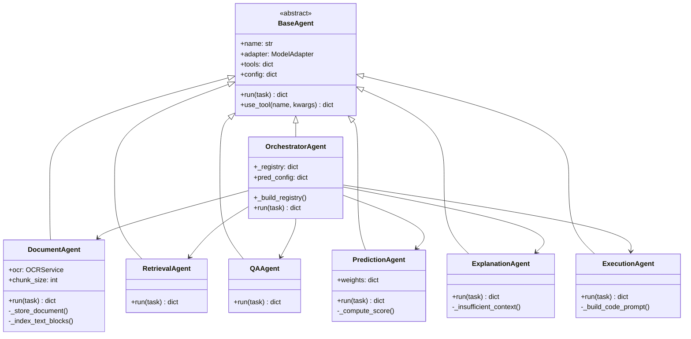
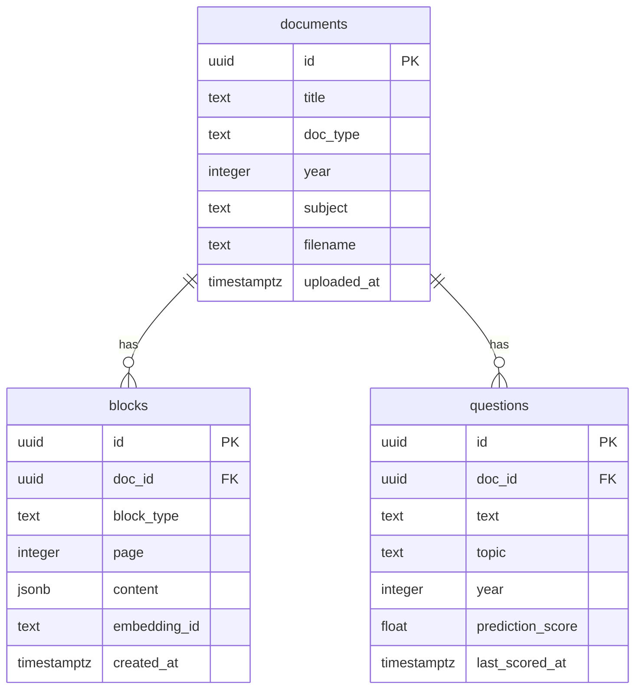
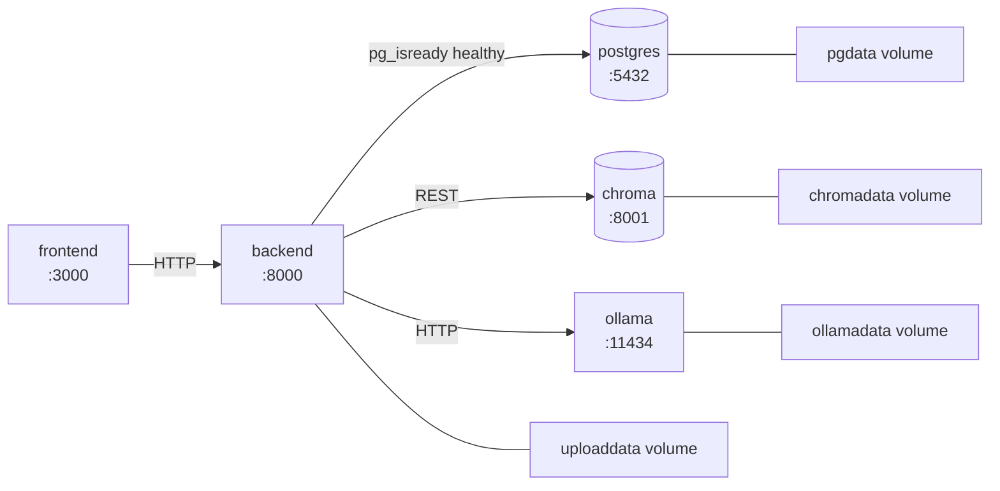
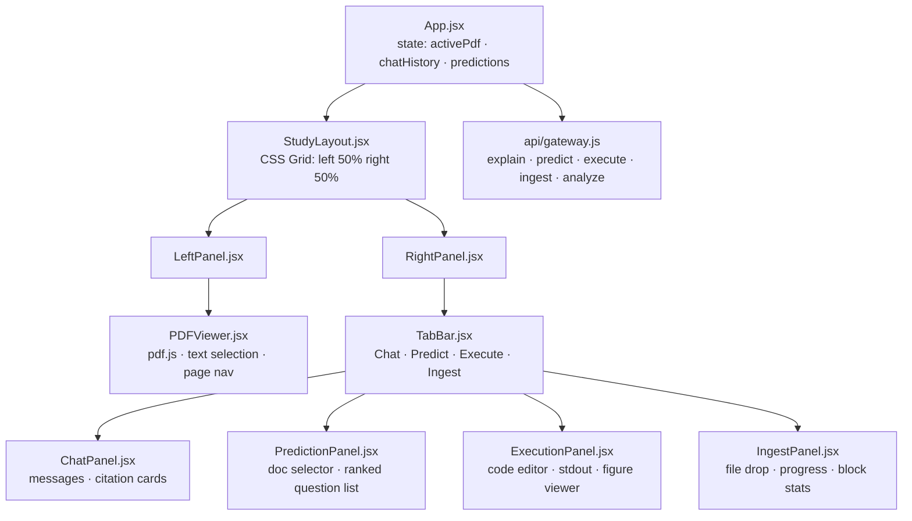
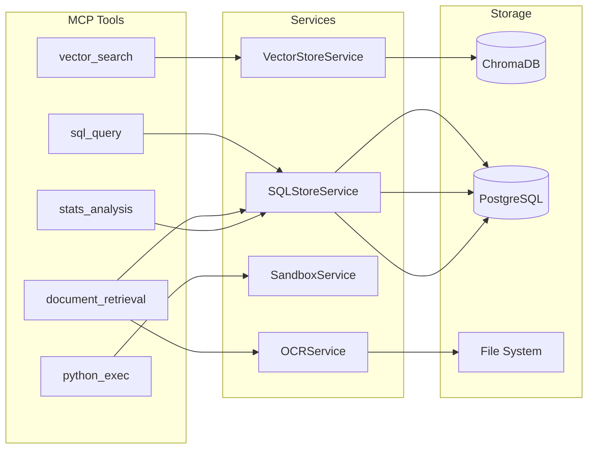

# τέλειος_Teleios — Full Agent Build Plan
> **Version:** 1.0 | **Status:** Active Development
> 
> This document is the single source of truth for an LLM agent executing the full build of τέλειος_Teleios.
> Every task is atomic, ordered, verifiable, and self-contained.
> Read the entire document before beginning. Execute tasks in phase order. Do not skip ahead.

---

## How to Use This Plan

- Tasks are ordered within each phase. Complete them top-to-bottom.
- Make a memory.md file where you will log what youre doing and what you are going to do 
- make git commit with proper messages
- Each task has: **What to build**, **exact file path**, **verification step**.
- Code that already exists is marked `[DONE]` — skip it, do not overwrite unless instructed.
- Every phase ends with a **Phase Gate** — a set of checks that must all pass before moving on.
- Use the architecture diagrams in Section 1 as your reference map at all times.

---

## Section 1 — Architecture Diagrams

### 1.1 Full System Architecture



### 1.2 Request Lifecycle



### 1.3 Document Ingestion Pipeline



### 1.4 Exam Prediction Flow



### 1.5 ModelAdapter Strategy Pattern



### 1.6 Agent Class Hierarchy



### 1.7 Database Schema (ERD)



### 1.8 Docker Compose Service Graph



### 1.9 Frontend Component Tree



### 1.10 MCP Tool Dependency Map



---

## Section 2 — Project State Inventory

### Create

| File | Status |
|---|---|
| `config/app.json` | [TO DO] |
| `config/models.json` | [TO DO] |
| `config/agents.json` | [TO DO] |
| `config/prediction.json` | [TO DO] |
| `config/tools.json` | [TO DO] |
| `docker-compose.yml` | [TO DO] |
| `backend/Dockerfile` | [TO DO] |
| `backend/requirements.txt` | [TO DO] |
| `backend/main.py` | [TO DO] |
| `backend/gateway/schemas.py` | [TO DO] |
| `backend/gateway/router.py` | [TO DO] |
| `backend/gateway/middleware.py` | [TO DO] |
| `backend/adapters/model_adapter.py` | [TO DO] |
| `backend/adapters/ollama_adapter.py` | [TO DO] |
| `backend/adapters/openai_adapter.py` | [TO DO] |
| `backend/adapters/anthropic_adapter.py` | [TO DO] |
| `backend/adapters/vllm_adapter.py` | [TO DO] |
| `backend/adapters/__init__.py` | [TO DO] |
| `backend/agents/base_agent.py` | [TO DO] |
| `backend/agents/orchestrator.py` | [TO DO] |
| `backend/agents/document_agent.py` | [TO DO] |
| `backend/agents/retrieval_agent.py` | [TO DO] |
| `backend/agents/explanation_agent.py` | [TO DO] |
| `backend/agents/qa_agent.py` | [TO DO] |

### Not Yet Built — These Are Your Tasks

Everything in Phases 1–8 below.

---

## Section 3 — Build Phases

---

## PHASE 1 — Database Layer
**Goal:** PostgreSQL is running with correct schema. Python can write and read records.

---

### Task 1.1 — SQL Migration Script
**File:** `backend/db/migrations/001_initial.sql`

Create the full initial schema. This file is automatically run by the postgres Docker container on first boot (mounted at `/docker-entrypoint-initdb.d/`).

```sql
CREATE EXTENSION IF NOT EXISTS "pgcrypto";

CREATE TABLE documents (
    id           UUID PRIMARY KEY DEFAULT gen_random_uuid(),
    title        TEXT NOT NULL,
    doc_type     TEXT NOT NULL CHECK (doc_type IN ('textbook','past_paper','unknown')),
    year         INTEGER,
    subject      TEXT,
    filename     TEXT NOT NULL,
    uploaded_at  TIMESTAMPTZ NOT NULL DEFAULT NOW()
);

CREATE TABLE blocks (
    id           UUID PRIMARY KEY DEFAULT gen_random_uuid(),
    doc_id       UUID NOT NULL REFERENCES documents(id) ON DELETE CASCADE,
    block_type   TEXT NOT NULL CHECK (block_type IN ('text','equation','figure','table')),
    page         INTEGER NOT NULL DEFAULT 0,
    content      JSONB NOT NULL,
    embedding_id TEXT,
    created_at   TIMESTAMPTZ NOT NULL DEFAULT NOW()
);

CREATE TABLE questions (
    id               UUID PRIMARY KEY DEFAULT gen_random_uuid(),
    doc_id           UUID NOT NULL REFERENCES documents(id) ON DELETE CASCADE,
    text             TEXT NOT NULL,
    topic            TEXT,
    year             INTEGER,
    prediction_score FLOAT NOT NULL DEFAULT 0.0,
    last_scored_at   TIMESTAMPTZ
);

CREATE INDEX idx_blocks_doc_id    ON blocks(doc_id);
CREATE INDEX idx_blocks_type      ON blocks(block_type);
CREATE INDEX idx_questions_doc_id ON questions(doc_id);
CREATE INDEX idx_questions_topic  ON questions(topic);
CREATE INDEX idx_questions_year   ON questions(year);
```

**Verify:** `docker compose exec postgres psql -U teleios -d teleios -c "\dt"` — must show `documents`, `blocks`, `questions`.

---

### Task 1.2 — SQLAlchemy Models
**File:** `backend/db/models.py`

Define SQLAlchemy ORM models matching the migration exactly. Use `mapped_column` syntax (SQLAlchemy 2.x). Import `Base` from a shared `base.py`. Every column must match the migration types.

Models to define:
- `Document` — id (UUID), title, doc_type, year, subject, filename, uploaded_at
- `Block` — id (UUID), doc_id (FK→documents), block_type, page, content (JSON), embedding_id, created_at
- `Question` — id (UUID), doc_id (FK→documents), text, topic, year, prediction_score, last_scored_at

**Verify:** `from db.models import Document, Block, Question` imports without error in a Python shell.

---

### Task 1.3 — Database Session
**File:** `backend/db/session.py`

Implement:
- `init_db(postgres_url: str)` — creates the async engine, stores it globally
- `get_async_session()` — async context manager yielding an `AsyncSession`

Use `sqlalchemy.ext.asyncio.create_async_engine` with `asyncpg` driver. The URL must replace `postgresql://` with `postgresql+asyncpg://`. Use `AsyncSession` with `expire_on_commit=False`.

**Verify:** Unit test can call `init_db` with a mock URL without error (import test only).

---

### Task 1.4 — `__init__.py` for db package
**File:** `backend/db/__init__.py`

Export: `init_db`, `get_async_session`, `Document`, `Block`, `Question`.

---

### Phase 1 Gate ✅
- [ ] `001_initial.sql` exists and has all 3 tables + indexes
- [ ] `db/models.py` has `Document`, `Block`, `Question` ORM classes
- [ ] `db/session.py` has `init_db` and `get_async_session`
- [ ] `db/__init__.py` exports all four symbols
- [ ] `python -c "from db import Document, Block, Question, init_db, get_async_session"` — no error

---

## PHASE 2 — Services Layer
**Goal:** VectorStoreService, OCRService, and SandboxService are implemented and testable in isolation.

---

### Task 2.1 — VectorStoreService
**File:** `backend/services/vector_store.py`

Implement `VectorStoreService` using the `chromadb` Python client.

Constructor: `__init__(self, storage_config: dict)` — reads `vector_backend`, `vector_collection`, connects to ChromaDB at `http://chroma:8001`.

Methods:
- `add(doc_id, title, page, text, embedding, block_id)` — upsert a document into the collection with metadata `{doc_id, title, page, block_id}`
- `search(query_embedding, top_k, doc_id=None) -> list[dict]` — query the collection. If `doc_id` is provided, filter by metadata. Return list of `{id, text, score, doc_id, title, page}`.
- `delete_by_doc(doc_id)` — remove all entries for a document

Use `chromadb.AsyncHttpClient` pointed at `http://chroma:8001`. Collection name from config. Distance metric: cosine.

**Verify:** `from services.vector_store import VectorStoreService` — no import error.

---

### Task 2.2 — SQLStoreService
**File:** `backend/services/sql_store.py`

Implement `SQLStoreService` wrapping the async session.

Methods:
- `execute_query(query: str, params: list) -> list[dict]` — run parameterized SELECT, return list of row dicts
- `insert_document(doc: dict) -> str` — insert into documents, return id
- `insert_block(block: dict) -> str` — insert into blocks, return id
- `insert_question(question: dict) -> str` — insert into questions, return id
- `get_questions_by_docs(doc_ids: list[str]) -> list[dict]` — fetch all questions for given doc_ids

All write operations must commit. Raise `ValueError` for any non-parameterized query (check that params are not empty for WHERE clauses).

**Verify:** `from services.sql_store import SQLStoreService` — no import error.

---

### Task 2.3 — OCRService
**File:** `backend/services/ocr_service.py`

Implement `OCRService` with `extract_blocks(pdf_bytes: bytes) -> list[dict]`.

Pipeline per page (using `pymupdf` / `fitz`):
1. Open PDF from bytes: `fitz.open(stream=pdf_bytes, filetype="pdf")`
2. For each page:
   - Extract text blocks with `page.get_text("dict")` — yields text blocks with bbox
   - For each image xref on the page, extract with `page.get_image_bbox` + `doc.extract_image`
   - Classify images: if the image is small and isolated → equation candidate; larger → figure
   - Extract tables using `page.find_tables()` (PyMuPDF 1.23+)
3. Return a flat list of typed dicts (TextBlock, EquationBlock, FigureBlock, TableBlock schemas)

Text block dict format: `{"type": "text", "content": str, "page": int, "bbox": [x0,y0,x1,y1]}`
Image block dict format: `{"type": "figure"|"equation", "image_b64": str, "page": int, "description": None}`
Table block dict format: `{"type": "table", "rows": [[str]], "caption": None, "page": int}`

Import `easyocr` only if `config["engine"] == "easyocr"` and use it for image OCR to populate `description` field. Fall back to `pytesseract` if easyocr unavailable.

**Verify:** `from services.ocr_service import OCRService` — no import error.

---

### Task 2.4 — SandboxService
**File:** `backend/services/sandbox_service.py`

Implement `SandboxService` with `execute(code: str, timeout: int) -> dict`.

Use `RestrictedPython` to compile and execute code safely.

Allowed globals: `math`, `sympy`, `numpy`, `scipy`, `matplotlib.pyplot` (in Agg backend to suppress display), `print`, standard builtins (`abs`, `len`, `range`, `round`, `sum`, `min`, `max`, `sorted`, `enumerate`, `zip`).

Execution flow:
1. Set matplotlib backend to `Agg` before any execution
2. Compile code with `RestrictedPython.compile_restricted`
3. Execute in restricted globals with `exec` inside `concurrent.futures.ThreadPoolExecutor` with timeout
4. Capture stdout via `io.StringIO`
5. After execution, check `matplotlib.pyplot.get_fignums()` — for each figure, save as base64 PNG
6. Return `{"stdout": str, "figures": [base64_str], "error": None}` on success
7. On timeout: return `{"stdout": "", "figures": [], "error": "Execution timed out"}`
8. On security violation or exception: return `{"stdout": "", "figures": [], "error": str(exc)}`

**Verify:** `from services.sandbox_service import SandboxService` — no import error.

---

### Task 2.5 — `__init__.py` for services
**File:** `backend/services/__init__.py`

Export: `VectorStoreService`, `SQLStoreService`, `OCRService`, `SandboxService`.

---

### Phase 2 Gate ✅
- [ ] All 4 service files exist
- [ ] `python -c "from services import VectorStoreService, SQLStoreService, OCRService, SandboxService"` — no error
- [ ] `OCRService` accepts `bytes` and returns a list
- [ ] `SandboxService` blocks `import os` attempts and returns error dict

---

## PHASE 3 — MCP Tool Layer
**Goal:** All 5 tools are implemented, follow the BaseTool interface, and are wired into a registry.

---

### Task 3.1 — BaseTool
**File:** `backend/tools/base_tool.py`

```python
from abc import ABC, abstractmethod
from pydantic import BaseModel
from typing import Any

class ToolDefinition(BaseModel):
    name: str
    description: str
    input_schema: dict
    output_schema: dict
    permissions: list[str]

class BaseTool(ABC):
    definition: ToolDefinition

    @abstractmethod
    async def execute(self, **kwargs) -> dict[str, Any]:
        ...
```

---

### Task 3.2 — VectorSearchTool
**File:** `backend/tools/vector_search.py`

Implement `VectorSearchTool(BaseTool)`.

`execute(query, top_k=6, doc_id=None)`:
1. Generate embedding: `await self.adapter.embed(query)` — the tool must hold a reference to the adapter
2. Call `self.vector_store.search(query_embedding, top_k, doc_id)`
3. Return `{"results": [...]}`

Constructor: `__init__(self, adapter, vector_store: VectorStoreService)`

`definition.name = "vector_search"`, `permissions = ["retrieval_agent", "explanation_agent", "qa_agent"]`

---

### Task 3.3 — SQLQueryTool
**File:** `backend/tools/sql_query.py`

Implement `SQLQueryTool(BaseTool)`.

`execute(query: str, params: list = None)`:
1. Call `self.sql_store.execute_query(query, params or [])`
2. Return `{"rows": [...], "count": len(rows)}`

Reject any query string containing `DROP`, `DELETE`, `TRUNCATE`, `ALTER` (case-insensitive) — return `{"error": "Destructive queries are not permitted"}`.

Constructor: `__init__(self, sql_store: SQLStoreService)`

---

### Task 3.4 — PythonExecTool
**File:** `backend/tools/python_exec.py`

Implement `PythonExecTool(BaseTool)`.

`execute(code: str, timeout_seconds: int = 10)`:
1. Call `self.sandbox.execute(code, timeout_seconds)`
2. Return the dict from sandbox directly: `{"stdout", "figures", "error"}`

Constructor: `__init__(self, sandbox: SandboxService)`

---

### Task 3.5 — DocumentRetrievalTool
**File:** `backend/tools/document_retrieval.py`

Implement `DocumentRetrievalTool(BaseTool)`.

`execute(action: str, **kwargs)` — dispatches on `action`:
- `"index"` — call `vector_store.add(...)` then `sql_store.insert_block(...)`, return `{"status": "indexed"}`
- `"fetch"` — call `sql_store.execute_query` to fetch blocks by doc_id/page, return `{"blocks": [...]}`

Constructor: `__init__(self, vector_store, sql_store, ocr_service)`

---

### Task 3.6 — StatsAnalysisTool
**File:** `backend/tools/stats_analysis.py`

Implement `StatsAnalysisTool(BaseTool)`.

`execute(operation: str, data: list)` — dispatches on `operation`:
- `"frequency"` — count occurrences of each `topic` in `data`, return `{"frequency": {topic: count}}`
- `"recency"` — given list of `{"year": int}` dicts and `decay_years`, return `{"recency": {year: score}}` using `score = max(0, 1 - (current_year - year) / decay_years)`
- `"normalize"` — normalize a list of `{"id", "value"}` dicts to 0-1 range, return `{"normalized": [...]}`

Use `datetime.date.today().year` for current year.

---

### Task 3.7 — Tool Registry Builder
**File:** `backend/tools/registry.py`

Implement `build_tool_registry(tools_cfg, app_cfg, vector_store) -> dict[str, BaseTool]`.

This function:
1. Creates all service instances: `SQLStoreService()`, `SandboxService(app_cfg["sandbox"])`, `OCRService(app_cfg["ocr"])`
2. Instantiates all 5 tool classes
3. Returns dict keyed by tool name: `{"vector_search": ..., "sql_query": ..., ...}`

The adapter is not yet available at registry build time — `VectorSearchTool` and `DocumentRetrievalTool` receive `adapter=None` initially. The Orchestrator will inject the adapter after construction via a `set_adapter(adapter)` method that you must add to these two tools.

---

### Task 3.8 — `__init__.py` for tools
**File:** `backend/tools/__init__.py`

Export: `BaseTool`, `build_tool_registry`.

---

### Phase 3 Gate ✅
- [ ] All 5 tool files exist
- [ ] `from tools import BaseTool, build_tool_registry` — no error
- [ ] `SQLQueryTool` rejects `DROP TABLE` queries
- [ ] `StatsAnalysisTool("frequency", [...])` returns correct counts
- [ ] All tools have `definition.name` matching the key in `tools.json`

---

## PHASE 4 — Remaining Agents
**Goal:** The two missing agents are built. All 6 agents are functional. Orchestrator registry is complete.

---

### Task 4.1 — PredictionAgent
**File:** `backend/agents/prediction_agent.py`

Implement `PredictionAgent(BaseAgent)`.

`run(task)`:
1. Fetch `doc_ids` from task
2. Query all questions for those docs via `sql_query` tool
3. For each question, compute the prediction score:
   ```
   score = w1*topic_frequency + w2*recency + w3*textbook_importance + w4*similarity
   ```
   - `topic_frequency`: use `stats_analysis` tool with `operation="frequency"` on all question topics, normalize
   - `recency`: use `stats_analysis` tool with `operation="recency"` on question years
   - `textbook_importance`: default `0.5` (no data yet) — placeholder for future implementation
   - `similarity`: embed the question text and search vector store for similarity score to most recent paper
4. Filter by `min_score_threshold`
5. Sort descending, take `top_n`
6. Update `prediction_score` in DB via `sql_query`
7. Return `PredictResponse`-shaped dict: `{questions: [...], total_scored: int, weights_used: dict}`

Weights come from `self.config["weights"]`.

---

### Task 4.2 — ExecutionAgent
**File:** `backend/agents/execution_agent.py`

Implement `ExecutionAgent(BaseAgent)`.

`run(task)`:
1. Receive `code` and optional `context` from task
2. If `context` is provided, send to model: `"Generate Python code to: {context}"` — get code back from adapter
3. If `code` is provided directly, use it as-is (model-generated or user-written)
4. Execute via `python_exec` tool: `result = await self.use_tool("python_exec", code=final_code, timeout_seconds=self.config.get("timeout_seconds", 10))`
5. Return `{"stdout": ..., "figures": [...], "error": ..., "verified": result.get("error") is None}`

**Important:** Never execute unsanitized user input directly if `context` was the trigger — always route through the model for code generation first.

---

### Task 4.3 — Add `prediction_agent.py` and `execution_agent.py` to agents `__init__.py`
**File:** `backend/agents/__init__.py`

Export all 7 agent classes.

---

### Phase 4 Gate ✅
- [ ] `backend/agents/prediction_agent.py` exists
- [ ] `backend/agents/execution_agent.py` exists
- [ ] `from agents import PredictionAgent, ExecutionAgent` — no error
- [ ] `OrchestratorAgent` in `orchestrator.py` already imports both — verify it compiles clean
- [ ] `AGENT_MANIFEST` in orchestrator covers all 6 intents: `ingest, explain, predict, execute, question, retrieve`

---

## PHASE 5 — Integration Wiring
**Goal:** All layers are connected. `docker compose up` starts cleanly. `/health` returns 200.

---

### Task 5.1 — Fix `main.py` lifespan adapter injection
**File:** `backend/main.py` (edit existing)

After building the tool registry (`tools = build_tool_registry(...)`), inject the adapter into tools that need it:
```python
tools["vector_search"].set_adapter(adapter)
tools["document_retrieval"].set_adapter(adapter)
```
Add these two lines after `adapter = get_adapter(model_cfg)` and before `OrchestratorAgent(...)` is created.

---

### Task 5.2 — Frontend Dockerfile
**File:** `frontend/Dockerfile`

```dockerfile
FROM node:20-alpine
WORKDIR /app
COPY package.json package-lock.json ./
RUN npm ci
COPY . .
EXPOSE 3000
CMD ["npm", "start"]
```

---

### Task 5.3 — `frontend/package.json`
**File:** `frontend/package.json`

Standard Create React App package.json with these dependencies:
- `react`, `react-dom` — `^18.3.0`
- `react-scripts` — `5.0.1`
- `bootstrap` — `^5.3.3`
- `react-bootstrap` — `^2.10.2`
- `pdfjs-dist` — `^4.4.168`
- `axios` — `^1.7.2`
- `react-syntax-highlighter` — `^15.5.0`

Proxy: `"proxy": "http://backend:8000"` in package.json root.

---

### Task 5.4 — `frontend/public/index.html`
**File:** `frontend/public/index.html`

Standard CRA `index.html` with `<div id="root">`. Title: `τέλειος Teleios`.

---

### Task 5.5 — Gateway API client
**File:** `frontend/src/api/gateway.js`

Implement all API calls using `axios`. Base URL from `process.env.REACT_APP_API_URL || ""`.

Functions (all async, all handle errors by returning `{error: string}`):
- `ingest(file: File) -> Promise<IngestResponse>` — POST `/ingest` as FormData
- `explain(query, docId=null, highlightedText=null) -> Promise<ExplainResponse>` — POST `/explain`
- `predict(docIds, subject=null) -> Promise<PredictResponse>` — POST `/predict`
- `execute(code, context=null) -> Promise<ExecuteResponse>` — POST `/execute`
- `analyze(docIds, groupBy="topic") -> Promise<QuestionAnalysisResponse>` — POST `/analyze`
- `health() -> Promise<HealthResponse>` — GET `/health`

---

### Phase 5 Gate ✅
- [ ] `frontend/Dockerfile` exists
- [ ] `frontend/package.json` exists with all deps
- [ ] `frontend/public/index.html` exists
- [ ] `frontend/src/api/gateway.js` exists with all 6 functions
- [ ] `main.py` calls `set_adapter` on vector_search and document_retrieval tools
- [ ] `docker compose build` completes without error

---

## PHASE 6 — React Frontend
**Goal:** Full study workspace UI is functional in the browser.

---

### Task 6.1 — `App.jsx`
**File:** `frontend/src/App.jsx`

Root component. Manages global state:
- `documents: []` — list of ingested docs `{doc_id, title}`
- `activePdfUrl: null` — currently displayed PDF URL
- `chatHistory: []` — list of `{role, content, citations}`
- `predictions: []`
- `activeTab: "chat"` — current right-panel tab

Renders `<StudyLayout>` passing all state + setters as props. Imports Bootstrap CSS at the top.

---

### Task 6.2 — `StudyLayout.jsx`
**File:** `frontend/src/components/StudyLayout.jsx`

CSS Grid layout: two columns, each 50% width, full viewport height.
- Left column: `<PDFViewer>`
- Right column: `<TabBar>` + active panel

No business logic here — pure layout.

---

### Task 6.3 — `PDFViewer.jsx`
**File:** `frontend/src/components/PDFViewer.jsx`

Props: `pdfUrl: string | null`, `onTextSelect: (text: string) => void`

Implement using `pdfjs-dist`:
1. Load PDF from `pdfUrl` when it changes
2. Render current page to a `<canvas>` element
3. Page navigation: prev/next buttons + current/total display
4. Text selection: listen to `mouseup` on the canvas container, call `window.getSelection().toString()`, if non-empty call `onTextSelect`
5. If `pdfUrl` is null, show a placeholder: "No document loaded. Upload a PDF to begin."

Set `pdfjsLib.GlobalWorkerOptions.workerSrc` to the correct CDN URL for the installed version.

---

### Task 6.4 — `ChatPanel.jsx`
**File:** `frontend/src/components/ChatPanel.jsx`

Props: `history: []`, `onSend: (msg) => void`, `highlightedText: string | null`, `loading: bool`

Renders:
- Scrollable message list. Each message: role label, content text, citation cards below (if present)
- Citation card: `{title} — page {page}` with a small excerpt
- If `highlightedText` is set, show a yellow banner: "Asking about: '{highlightedText}'" with an X to dismiss
- Text input + Send button (disabled while loading)
- On send: call `onSend` with the message text

---

### Task 6.5 — `PredictionPanel.jsx`
**File:** `frontend/src/components/PredictionPanel.jsx`

Props: `documents: []`, `predictions: []`, `onPredict: (docIds) => void`, `loading: bool`

Renders:
- Multi-select checkbox list of ingested documents
- "Predict Exam Questions" button (disabled if no docs selected or loading)
- Results list: each question shows text, topic, year, score (as a colored progress bar 0–1)
- Score color: green ≥ 0.7, yellow 0.4–0.7, red < 0.4
- Empty state: "Select documents and click Predict to see likely exam questions."

---

### Task 6.6 — `ExecutionPanel.jsx`
**File:** `frontend/src/components/ExecutionPanel.jsx`

Props: `onExecute: (code) => void`, `result: {stdout, figures, error} | null`, `loading: bool`

Renders:
- `<textarea>` for code input (monospace font, min 10 rows)
- "Run" button (disabled while loading)
- Output section:
  - stdout in a dark `<pre>` block
  - Each figure as ``
  - Error in red if present

---

### Task 6.7 — `IngestPanel.jsx`
**File:** `frontend/src/components/IngestPanel.jsx`

Props: `onIngest: (file) => void`, `loading: bool`, `lastResult: IngestResponse | null`

Renders:
- Drag-and-drop zone (accept `.pdf` only). On drop or file input change, call `onIngest`
- Upload button as fallback
- While loading: spinner + "Processing PDF..."
- After success: show `lastResult.title`, pages, blocks_extracted, block_types as a small table
- Error state if `lastResult.status === "failed"`

---

### Task 6.8 — `TabBar.jsx`
**File:** `frontend/src/components/TabBar.jsx`

Props: `activeTab: str`, `onTabChange: (tab) => void`

Renders Bootstrap Nav tabs: Chat, Predict, Execute, Ingest. Active tab highlighted. Purely presentational.

---

### Task 6.9 — Wire everything in `App.jsx`
**File:** `frontend/src/App.jsx` (complete implementation)

Complete the App logic:
- `handleSend(msg)` — calls `gateway.explain(msg, activePdfDoc?.doc_id, highlightedText)`, appends to `chatHistory`
- `handleIngest(file)` — calls `gateway.ingest(file)`, adds to `documents`, stores file as object URL for `activePdfUrl`
- `handlePredict(docIds)` — calls `gateway.predict(docIds)`, sets `predictions`
- `handleExecute(code)` — calls `gateway.execute(code)`, sets `execResult`
- `handleTextSelect(text)` — sets `highlightedText`, switches to chat tab

---

### Phase 6 Gate ✅
- [ ] All 8 component files exist
- [ ] `npm run build` in frontend directory completes without error
- [ ] PDF viewer renders a page from a test PDF
- [ ] Chat panel sends a message and receives a mock response
- [ ] Ingest panel shows drag-and-drop zone
- [ ] Prediction panel shows document checkboxes

---

## PHASE 7 — Tests
**Goal:** Unit and integration tests pass. Coverage is measurable.

---

### Task 7.1 — `conftest.py`
**File:** `tests/conftest.py`

Define shared pytest fixtures:
- `mock_adapter` — `AsyncMock` of `ModelAdapter` with `generate`, `chat`, `embed` methods returning sensible defaults
- `mock_vector_store` — `AsyncMock` of `VectorStoreService`
- `mock_sql_store` — `AsyncMock` of `SQLStoreService`
- `mock_sandbox` — `MagicMock` of `SandboxService`
- `sample_pdf_bytes` — load `tests/fixtures/sample.pdf` as bytes (create a 1-page minimal PDF)

---

### Task 7.2 — Create minimal fixture PDF
**File:** `tests/fixtures/sample.pdf`

Create a minimal valid PDF using PyMuPDF:
```python
import fitz
doc = fitz.open()
page = doc.new_page()
page.insert_text((50, 50), "This is a test document about calculus. Question: What is a derivative?")
doc.save("tests/fixtures/sample.pdf")
```

Run this once as a setup script `tests/fixtures/create_fixtures.py`.

---

### Task 7.3 — Adapter unit tests
**File:** `tests/unit/test_adapters.py`

Tests:
- `test_ollama_adapter_generate` — mock `httpx.AsyncClient.post`, verify correct URL and model
- `test_ollama_adapter_chat` — same for `/api/chat` endpoint
- `test_ollama_adapter_embed` — same for `/api/embeddings`
- `test_adapter_factory_ollama` — `get_adapter({"active_provider": "ollama", ...})` returns `OllamaAdapter`
- `test_adapter_factory_unknown` — raises `ValueError` for unknown provider

---

### Task 7.4 — Tool unit tests
**File:** `tests/unit/test_tools.py`

Tests:
- `test_sql_query_tool_rejects_drop` — `SQLQueryTool.execute(query="DROP TABLE x")` returns `{"error": ...}`
- `test_stats_frequency` — `StatsAnalysisTool.execute("frequency", [{"topic": "calculus"}, {"topic": "calculus"}, {"topic": "algebra"}])` returns `{"frequency": {"calculus": 2, "algebra": 1}}`
- `test_stats_recency` — recency score for current year = 1.0, 3 years ago ≈ 0.0
- `test_python_exec_safe` — `PythonExecTool.execute(code="print(1+1)")` returns `{"stdout": "2\n", ...}`
- `test_python_exec_timeout` — `PythonExecTool.execute(code="while True: pass", timeout_seconds=1)` returns error

---

### Task 7.5 — Agent unit tests
**File:** `tests/unit/test_agents.py`

Tests:
- `test_explanation_agent_no_context` — when `vector_search` returns empty results, confidence is `insufficient_context`
- `test_explanation_agent_with_context` — with mock hits, calls adapter.chat and parses response
- `test_qa_agent_frequency` — with mock SQL rows, returns correct topic stats
- `test_orchestrator_routing` — `orchestrator.run({"intent": "explain", ...})` calls explanation agent
- `test_orchestrator_unknown_intent` — returns `{"error": ...}` for unknown intent
- `test_orchestrator_tool_scoping` — explanation agent does not have `python_exec` tool

---

### Task 7.6 — Integration test: ingest pipeline
**File:** `tests/integration/test_ingest.py`

Test (uses `sample.pdf` fixture, real OCRService, mock DB):
- Upload sample.pdf bytes to `DocumentAgent.run`
- Assert response has `doc_id`, `blocks_extracted > 0`, `status == "success"`
- Assert at least one `TextBlock` in blocks

Mark with `@pytest.mark.integration`.

---

### Task 7.7 — Integration test: sandbox
**File:** `tests/integration/test_sandbox.py`

Tests:
- `test_safe_math` — execute `"import math; print(math.sqrt(16))"` → stdout contains `4.0`
- `test_sympy` — execute `"from sympy import symbols, diff; x=symbols('x'); print(diff(x**2))"` → stdout contains `2*x`
- `test_blocked_os` — execute `"import os; os.system('ls')"` → returns error
- `test_matplotlib_figure` — execute code that creates a plot → `figures` list is non-empty

Mark with `@pytest.mark.integration`.

---

### Task 7.8 — `pytest.ini`
**File:** `pytest.ini`

```ini
[pytest]
asyncio_mode = auto
markers =
    integration: mark test as integration test (requires running services)
testpaths = tests
```

---

### Phase 7 Gate ✅
- [ ] `pytest tests/unit/ -v` — all unit tests pass
- [ ] `pytest tests/integration/ -v` — integration tests pass (requires docker services)
- [ ] `pytest --co -q` — test collection shows ≥ 15 tests
- [ ] No test imports from `main.py` directly (tests import from packages only)

---

## PHASE 8 — Final Polish & Documentation
**Goal:** System is deployable. A developer can clone and run it in under 10 minutes.

---

### Task 8.1 — `.env.example`
**File:** `.env.example`

```
OPENAI_API_KEY=
ANTHROPIC_API_KEY=
```

---

### Task 8.2 — `README.md`
**File:** `README.md`

Sections:
1. **What is τέλειος_Teleios** — 2 sentences
2. **Quick Start** — 5 numbered steps: clone, copy `.env.example`, `docker compose up --build`, wait for health, open browser
3. **Switching Model Provider** — how to change `config/models.json` `active_provider`
4. **Ingesting Documents** — how to use the ingest panel
5. **Running Tests** — the pytest commands
6. **Contributing** — link to the developer documentation

---

### Task 8.3 — `backend/gateway/__init__.py`
**File:** `backend/gateway/__init__.py`

Empty file (marks package).

---

### Task 8.4 — `backend/agents/__init__.py`
**File:** `backend/agents/__init__.py`

Export all 7 agent classes.

---

### Task 8.5 — Verify complete file tree
Run: `find . -type f | grep -v node_modules | grep -v __pycache__ | grep -v .git | sort`

Expected output must include every file listed in Section 2 (Already Built) plus every file created in Phases 1–8.

---

### Task 8.6 — Smoke test
Run the following in sequence:

```bash
docker compose up -d
sleep 15
curl http://localhost:8000/health
# Expected: {"status":"ok","version":"1.0.0",...}
```

---

### Phase 8 Gate ✅
- [ ] `.env.example` exists
- [ ] `README.md` exists with all 6 sections
- [ ] All `__init__.py` files exist for every package
- [ ] `curl http://localhost:8000/health` returns `{"status":"ok",...}`
- [ ] Frontend loads at `http://localhost:3000`
- [ ] PDF upload completes without 500 error
- [ ] Explain endpoint returns a response with `citations` field

---

## Section 4 — Milestone Summary

| Milestone | Phase | Definition of Done |
|---|---|---|
| M1 — Foundation | Ph 1 + Ph 5 partial | Docker up, postgres healthy, `/health` 200 |
| M2 — Ingestion | Ph 2 + Ph 3 + Ph 4.1 | PDF upload → blocks in DB + vector index |
| M3 — RAG Explain | Ph 4 + Ph 5 | `/explain` returns grounded answer with citations |
| M4 — Prediction | Ph 4 | `/predict` returns ranked questions above threshold |
| M5 — Execution | Ph 4 | `/execute` runs sandboxed Python, returns stdout + figures |
| M6 — Frontend | Ph 6 | Full UI at localhost:3000, all panels functional |
| M7 — Tests | Ph 7 | All unit tests pass, integration tests documented |
| M8 — Deploy Ready | Ph 8 | README, env example, smoke test passes |

---

## Section 5 — Anti-Hallucination Checklist (enforce in every agent)

Before any agent returns a response, verify:

- [ ] Retrieved content was used — `context_used` list is non-empty (or intent is `execute`)
- [ ] Citations include `doc_id` + `page` for every claim
- [ ] No exam question was generated — only extracted, stored questions are returned by `PredictionAgent`
- [ ] If retrieval returned 0 hits → confidence must be `"insufficient_context"`
- [ ] Numerical answers that can be verified → route through `ExecutionAgent` and set `computation_verified: true`

---

## Section 6 — File Manifest (Complete Expected Tree)

```
teleios/
├── .env.example
├── README.md
├── pytest.ini
├── docker-compose.yml
├── config/
│   ├── app.json                       [DONE]
│   ├── agents.json                    [DONE]
│   ├── models.json                    [DONE]
│   ├── prediction.json                [DONE]
│   └── tools.json                     [DONE]
├── backend/
│   ├── Dockerfile                     [DONE]
│   ├── requirements.txt               [DONE]
│   ├── main.py                        [DONE — edit Task 5.1]
│   ├── gateway/
│   │   ├── __init__.py                [Task 8.3]
│   │   ├── middleware.py              [DONE]
│   │   ├── router.py                  [DONE]
│   │   └── schemas.py                 [DONE]
│   ├── adapters/
│   │   ├── __init__.py                [DONE]
│   │   ├── anthropic_adapter.py       [DONE]
│   │   ├── model_adapter.py           [DONE]
│   │   ├── ollama_adapter.py          [DONE]
│   │   ├── openai_adapter.py          [DONE]
│   │   └── vllm_adapter.py            [DONE]
│   ├── agents/
│   │   ├── __init__.py                [Task 8.4]
│   │   ├── base_agent.py              [DONE]
│   │   ├── document_agent.py          [DONE]
│   │   ├── execution_agent.py         [Task 4.2]
│   │   ├── explanation_agent.py       [DONE]
│   │   ├── orchestrator.py            [DONE]
│   │   ├── prediction_agent.py        [Task 4.1]
│   │   ├── qa_agent.py                [DONE]
│   │   └── retrieval_agent.py         [DONE]
│   ├── tools/
│   │   ├── __init__.py                [Task 3.8]
│   │   ├── base_tool.py               [Task 3.1]
│   │   ├── document_retrieval.py      [Task 3.5]
│   │   ├── python_exec.py             [Task 3.4]
│   │   ├── registry.py                [Task 3.7]
│   │   ├── sql_query.py               [Task 3.3]
│   │   ├── stats_analysis.py          [Task 3.6]
│   │   └── vector_search.py           [Task 3.2]
│   ├── services/
│   │   ├── __init__.py                [Task 2.5]
│   │   ├── ocr_service.py             [Task 2.3]
│   │   ├── sandbox_service.py         [Task 2.4]
│   │   ├── sql_store.py               [Task 2.2]
│   │   └── vector_store.py            [Task 2.1]
│   └── db/
│       ├── __init__.py                [Task 1.4]
│       ├── models.py                  [Task 1.2]
│       ├── session.py                 [Task 1.3]
│       └── migrations/
│           └── 001_initial.sql        [Task 1.1]
├── frontend/
│   ├── Dockerfile                     [Task 5.2]
│   ├── package.json                   [Task 5.3]
│   ├── public/
│   │   └── index.html                 [Task 5.4]
│   └── src/
│       ├── App.jsx                    [Task 6.1 + 6.9]
│       ├── api/
│       │   └── gateway.js             [Task 5.5]
│       └── components/
│           ├── ChatPanel.jsx          [Task 6.4]
│           ├── ExecutionPanel.jsx     [Task 6.6]
│           ├── IngestPanel.jsx        [Task 6.7]
│           ├── PDFViewer.jsx          [Task 6.3]
│           ├── PredictionPanel.jsx    [Task 6.5]
│           ├── StudyLayout.jsx        [Task 6.2]
│           └── TabBar.jsx             [Task 6.8]
└── tests/
    ├── conftest.py                    [Task 7.1]
    ├── pytest.ini                     [Task 7.8]
    ├── fixtures/
    │   ├── create_fixtures.py         [Task 7.2]
    │   └── sample.pdf                 [Task 7.2]
    ├── unit/
    │   ├── test_adapters.py           [Task 7.3]
    │   ├── test_agents.py             [Task 7.5]
    │   └── test_tools.py              [Task 7.4]
    └── integration/
        ├── test_ingest.py             [Task 7.6]
        └── test_sandbox.py            [Task 7.7]
```

---

*End of Plan. Total tasks: 38. Total phases: 8. Execute in order. Verify each phase gate before proceeding.*
